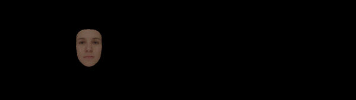

# RGB Face Tracking and Reconstruction using CUDA 

Results

On the left you can see a face reconstruction based on the input video from the right  

Barack Obama  
  

Justin Trudeau  

Setup configuration

Environment variables

Side notes:
***To run the project you will need a parametric face model***  
Use `OpenCV 4.0.0`

| NAME            | EXAMPLE VALUE                                                 |
|-----------------|---------------------------------------------------------------|
|GLFW3            |`\face-tracking\3rd\glfw-3.3\bin\lib-vc2017-64bit`             |
|OPENCV_DIR       |`\OpenCV\opencv\build\x64\vc15`                                |
|OPENCV_INCLUDE   |`\OpenCV\opencv\build\include`                                 |
|OPENCV_BIN 	  |`\OpenCV\opencv\build\x64\vc15\bin`                            |
|OPENCV_LIB 	  |`\OpenCV\opencv\build\x64\vc15\lib`                            |
|DLIB_DIR         |`\Projects\dlib`                                               |
|DLIB_LIB_DEBUG	  |`\Projects\dlib\examples\build\dlib_build\Debug`               |
|DLIB_LIB_RELEASE |`\Projects\dlib\examples\build\dlib_build\Release`             |

Extra files

| NAME                                  | VALUE                                    |
|---------------------------------------|------------------------------------------|
|shape_predictor_68_face_landmarks.dat  |`\face-tracking\project`             	   |

DLIB instruction

1) Download https://github.com/davisking/dlib Commit hash: e30f5e2fe88ff3a9c8265c6265b37956ce535ac2
2) Build examples and remember to set flags to ON in CMAKE:
	* DLIB_USE_CUDA
	* USE_SSE4_INSTRUCTIONS
	* USE_SSE2_INSTRUCTIONS
	* USE_AVX_INSTRUCTIONS
3) Build one of the project example in VS to generate dlib_build folder

References
* [A Morphable Model For The Synthesis Of 3D Faces](https://gravis.dmi.unibas.ch/publications/Sigg99/morphmod2.pdf)
* [Real-time Expression Transfer for Facial Reenactment](http://zollhoefer.com/papers/SGA2015_Face/paper.pdf)
* [Face2Face: Real-time Face Capture and Reenactment of RGB Videos](http://niessnerlab.org/papers/2019/8facetoface/thies2018face.pdf)
* [An Efficient Representation for Irradiance Environment Maps](https://cseweb.ucsd.edu/~ravir/papers/envmap/envmap.pdf)